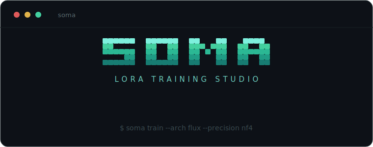

<div align="center">



[](LICENSE)
[](https://hub.docker.com/r/akiraxan/soma)
[](https://www.python.org/)

</div>

SOMA is a self-hosted tool for training character/style LoRAs. It uses its own `diffusers` + `peft`
training loops rather than wrapping kohya or ai-toolkit, with one small trainer per architecture. It can be
run from an interactive terminal launcher, a headless CLI, or a web UI served by the engine — on a local GPU
or in the cloud.

Developed and tested on an RTX 5080 (CUDA 12.8). The Docker image has been verified end-to-end, from
`docker run` to an exported `.safetensors` LoRA.

## Features

- 25 image architectures (listed below), covering flow-matching and epsilon objectives
- `nf4` / `int8` QLoRA, gradient checkpointing, cached latents and text embeddings — trains on 16 GB
- Three interfaces: CLI, interactive TUI, and a web UI (served on `:8765`)
- Docker image with NVIDIA GPU support
- LoRA export in ComfyUI / kohya format
- Dataset captioning (JoyCaption)

## Install and run

### Docker

```bash
# web UI
docker run --gpus all -p 8765:8765 \
  -v $PWD/data:/data -v $PWD/models:/models -v $PWD/cache:/cache/hf \
  akiraxan/soma serve
# then open http://localhost:8765/

# headless training
docker run --gpus all -v $PWD/data:/data -v $PWD/cache:/cache/hf \
  akiraxan/soma train --arch flux --base black-forest-labs/FLUX.1-dev \
  --dataset /data/mychar --precision nf4 --rank 16 --steps 1500
```

### From source

```bash
git clone https://github.com/thevesperhouse-hub/SOMA.git && cd SOMA
python engine/bootstrap.py            # venv + torch (cu128) + engine deps
npm install && npm run build          # web UI (optional)

python engine/cli.py                  # interactive launcher (no args)
python engine/cli.py train --arch sdxl --base /path/model.safetensors --dataset ./mychar --steps 1200
python engine/cli.py archs            # list architectures
```

`--base` accepts a Hugging Face repo id or a local checkpoint. `--config run.json` loads a full configuration
from a file. Running `cli.py` with no arguments opens the launcher, which includes a live training view (loss
curve, in-terminal sample preview, GPU telemetry).

## Supported architectures

| Family | Backend | Objective | Text encoder(s) |
|---|---|---|---|
| SDXL · Pony · Illustrious · NoobAI (eps & v-pred) | `sdxl` | epsilon / v-pred | CLIP-L + CLIP-G |
| SD 1.5 | `sd15` | epsilon | CLIP-L |
| Z-Image (Turbo / full / De-Turbo) | `zimage` | flow | Qwen3 |
| Flux.1-dev · FLUX.1 Krea | `flux` | flow | CLIP-L + T5 |
| Qwen-Image (+ 2512) | `qwen` | flow | Qwen2.5-VL |
| Chroma | `chroma` | flow | T5 |
| Lumina2 | `lumina2` | flow | Gemma-2 |
| SD 3.5 | `sd3` | flow | CLIP-L + CLIP-G + T5 |
| Sana | `sana` | flow | Gemma-2 |
| PixArt-Sigma | `pixart` | epsilon | T5 |
| Bria 3.x | `bria` | flow | T5 |
| AuraFlow | `auraflow` | flow | UMT5 |
| CogView4 | `cogview4` | flow | GLM-4 |
| Ovis-Image | `ovis` | flow | Qwen3 |
| Kolors | `kolors` | epsilon | ChatGLM3 |
| HunyuanImage | `hunyuanimage` | flow | Qwen2.5-VL |
| PRX | `prx` | flow | T5Gemma |

## Project structure

```
engine/
  families.py         registry: every model is one entry here
  trainer.py          dispatch: family → backend → trainer
  <arch>_trainer.py   one file per backend (flux, qwen, chroma, sana, …)
  quant.py            shared nf4/int8 QLoRA helpers
  captioner.py        JoyCaption dataset captioning
  server.py           FastAPI + WebSocket API, serves the web UI
  cli.py, launcher.py CLI and TUI
  model_configs/      bundled DiT configs (offline loading)
src/                  React + Vite + Tailwind web UI
```

Each trainer wires the model's VAE, text encoder(s), noising objective and LoRA targets through
`diffusers`/`peft`. Models are declared once in `families.py`; the UI, CLI and model scanner all read from
that registry.

## Adding an architecture

A new model is usually one trainer file plus a registry entry and a dispatch line. The steps and the
patterns to copy from are documented in [CONTRIBUTING.md](CONTRIBUTING.md).

## Roadmap

- Video architectures (Wan2.2 T2V/I2V)
- More image models (FLUX.2, OmniGen2, Krea-2, HiDream, ERNIE, Nucleus)
- Per-architecture slim Docker images
- Desktop installer (Tauri) bundling the engine
- Identity-similarity scoring

## License

[MIT](LICENSE).
